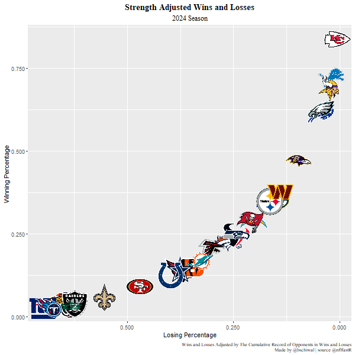
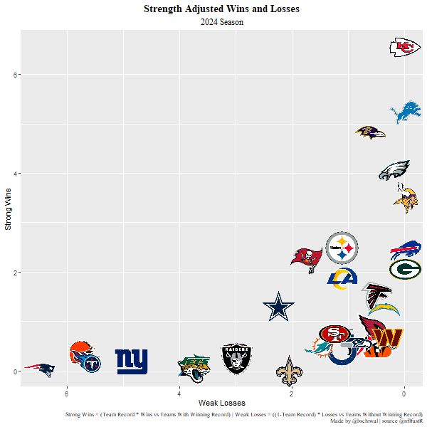

# NFL_Analysis

I enjoy football, but I am also a Vikings fan, so I don't enjoy football as much as I could. Looking at NFL data in new and different ways is just a passive-aggressive way to reconcile my bad decisions. 

## Introduction
This project analyzes different aspects of NFL football statistics. I will primarily be using the nflfastR package created by Ben Baldwin and Sebastian Carl. 

This package can be installed using the following code:

```
install.packages("nflfastR") 
```

## Code Examples

### Quarterback Clutch Efficiency

This code was used to show how efficient QB's were in clutch situations. It only looked at passing plays in the last two minutes of either half when down by one score: 
`qb_dropback==1,play_type=="pass",score_differential<=0,score_differential>=-8, half_seconds_remaining<=120 | game_half=="Overtime"`


### Team Record Analysis

This data set is a bit more complex to build as it requires a few iterative steps joined back to the teams to make the necessary calculations.  The intermediate data sets that are built are:
*Individual Team Record
*Team Record vs opponents with(and without) winning records
*Combined Record of all Opponents (total wins / total games |0.000:1.000 scale)
*Cumulative Record of all opponents(sum of each individual opponent record | can be over 1.000)

Using this data frame I then plot charts that take the data a bit further. 


#### Record Readjustment

First, I readjust the records of the teams using the cumulative record for all opponents. 
```
ggplot
  (teamrecords, 
  aes((opp_cum_rec_lose/opp_cum_rec)*(1-record),
  (opp_cum_rec_win/opp_cum_rec)*record))
  
```


#### Strong Wins and Weak Losses

Next, I plot the Strong wins and Weak Losses of each team by looking at just wins against winning teams and losses against losing teams. 

```
ggplot(
  teamrecords, 
  aes(losses_vs_not_winning_team*(1-record),
  wins_vs_winning_team*record))
```
