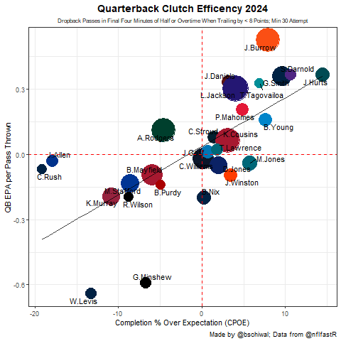

# NFL_Analysis
Sometimes I like to analyze sportsball data,

## Introduction
I want to use this project to analyze different aspects of NFL football statistics. I will primarily be using the nflfastR package created by Ben Baldwin and Yurko(?) and co.

```
install.packages("nflfastR") 
```

## Code Examples
This code was used to show how efficient QB's were in clutch situations. It only looked at passing plays in the last two minutes of either half when down by one score: 
`placeholder for future code insertion`


